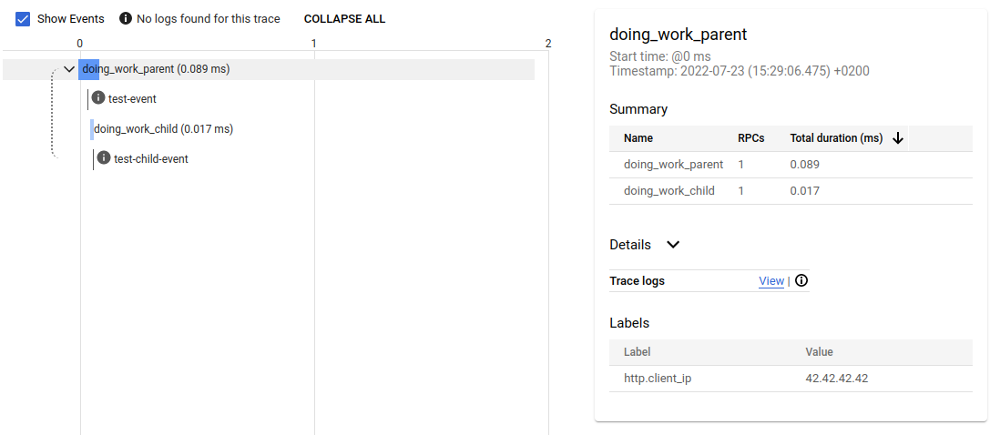

[](https://crates.io/crates/opentelemetry-gcloud-trace)


# OpenTelemetry support for Google Cloud Trace

## Quick start

Cargo.toml:
```toml
[dependencies]
opentelemetry-gcloud-trace = "0.6"
```

## Compatibility matrix

| opentelemetry-gcloud-trace version | opentelemetry version | tracing-opentelemetry | gcloud-sdk |
|------------------------------------|-----------------------|-----------------------|------------|
| 0.6                                | 0.20                  | 0.20                  | 0.20       |
| 0.5                                | 0.19                  | 0.19                  | 0.20       |
| 0.4                                | 0.18                  | 0.18                  | 0.19       |


Example:

```rust

use opentelemetry::KeyValue;
use opentelemetry::trace::*;
use opentelemetry_gcloud_trace::*;

let tracer: opentelemetry::sdk::trace::Tracer =
  GcpCloudTraceExporterBuilder::for_default_project_id().await? // or GcpCloudTraceExporterBuilder::new(config_env_var("PROJECT_ID")?)
    .install_simple() // use install_batch for production/performance reasons
    .await?;

tracer.in_span("doing_work_parent", |cx| {
  // ...
});

```
This is a basic configuration, not recommended for prod systems. See the [Performance](#performance) section for prod config.

All examples available at [examples](examples) directory.

To run example use with environment variables:
```
# PROJECT_ID=<your-google-project-id> cargo run --example enable-exporter
```



## Performance
For optimal performance, a batch exporter is recommended as the simple exporter will export
each span synchronously on drop. You can enable the [`rt-tokio`], [`rt-tokio-current-thread`]
features and specify a runtime on the pipeline to have a batch exporter
configured for you automatically.

```toml
[dependencies]
opentelemetry = { version = "*", features = ["rt-tokio"] }
opentelemetry-gcloud-trace = "*"
```

```rust
let tracer: opentelemetry::sdk::trace::Tracer =
   GcpCloudTraceExporterBuilder::for_default_project_id().await? // or GcpCloudTraceExporterBuilder::new(config_env_var("PROJECT_ID")?)
  .install_batch(
     opentelemetry::runtime::Tokio
   )
  .await?;
```

## Configuration

You can specify trace configuration using `with_trace_config`:

```rust
   GcpCloudTraceExporterBuilder::new(google_project_id).with_trace_config(
      trace::config()
         .with_sampler(Sampler::AlwaysOn)
         .with_id_generator(RandomIdGenerator::default())
   )
```

## Limitations
- This exporter doesn't support any other runtimes except Tokio.

## Licence
Apache Software License (ASL)

## Author
Abdulla Abdurakhmanov
